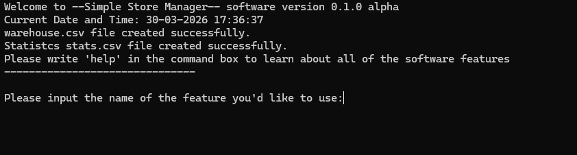
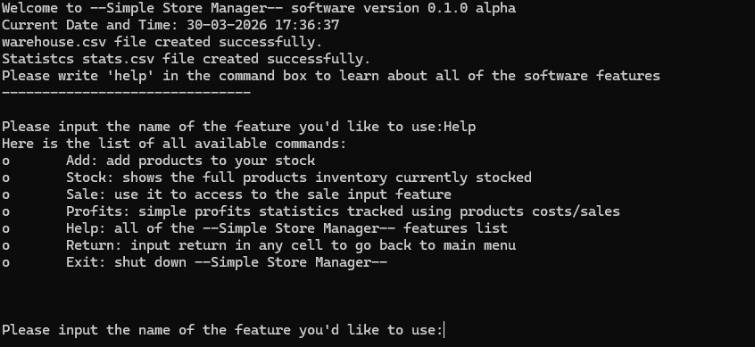

# Simple Store Manager (0.1.0 Alpha)

Simple Store Manager is a free, intuitive and easy to use command-line warehouse and stock manager software. It is written in Python.

## Description

Simple Store Manager is an **academic project** developed in **Python 3** with **Anaconda and Jupyter Notebook** during my 1st level postgraduate masters degree at ProfessionAi. 

The goal is simple, to have a **free command-line tool** capable of handling the core inventory tracking and sales operations of an ideal, generic, brick-and-mortar store. 

The software runs locally and it uses a simple database based on two .CSV files:
- One for managing warehouse stock;
- One for tracking basic statistics and profit;

Profits calculation is based on a simple revenue minus costs approach.
## Demo




## Features

- Warehouse and Stats .CSV files you can carry anywhere on a usb pen;
- Add function with existing item check through ID;
- Item wholesale price tracking;
- Simple profits calculation through revenue minus costs;
- "Cart" feature that allows to sell more then one item to a single customer through a single checkout;
- Modular Class coding which allows easy code expansion for new features development;
## Requirements

Python 3.x

**No external libraries required.**

Breakdown of imported modules as follows (counting all imports from all .IPYNB):

```
from version import Version
import datetime
import warehouse
import navigator
import csv
import random
from os.path import isfile
```
## Installation

Simple Store Manager repo hosts both .py executables and .IPYNB files to check up on code and fork your own version.

Follow the steps below to run the app locally:

```
# Clone the repository
>$ git clone https://github.com/sandbox115/simple-store-manager.git

# Change directory into it
>$ cd simple-store-manager

#Open your Command Prompt or Anaconda prompt base env or standard env
python gest_main.py 

or 

python -m gest_main
```

If everything went fine you should see the main menu in screenshot1 or read:

```
Welcome to --Simple Store Manager-- software version 0.1.0 alpha
Current Date and Time: 30-03-2026 22:37:07
warehouse.csv file created successfully.
Statistcs stats.csv file created successfully.
Please write 'help' in the command box to learn about all of the software features
-------------------------------

Please input the name of the feature you'd like to use:

```
Just like shown above, the software will create warehouse and stats.CSV files on startup if they're not in local folder. 

The files will be found and database creation will be skipped otherwise.

**Note:** If you want to use the software on another PC you can easily copy these files and bring them onto another computer by placing them into the local folder.

Make sure to have python installed and updated and on your PATH environment variable.
## Contributing to the project

This started as an academic project for my Python final exam though i'd really love for people to extend on this base and develop new features for everybody's usage. 

It is still in its infancy and there are many advanced features which could be added to make it a complete project, though the base is solid and already available.

To contribute to the project please follow this procedure:

- Fork this repo or clone: 
```
git clone https://github.com/sandbox115/simple-store-manager.git
```
- change directory into folder:

```
cd simple-store-manager
```
- Create your feature branch and make your contributions to your local copy of the project
- Raise a pull request against the development branch describing what your feature does and how it can be tested
## Credits

Developed by Sandbox 1115 on Jupyter Notebook
## License

Released under [MIT](https://choosealicense.com/licenses/mit/) license

